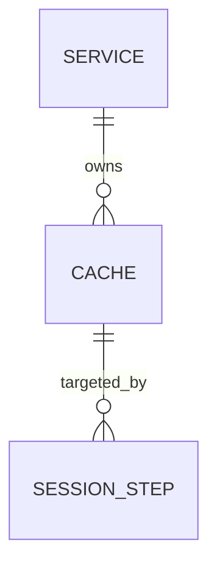

# AI Guidelines: Repository Documentation Standards

> [!IMPORTANT]
> This document provides guidelines for using AI assistance (e.g., GitHub Copilot) effectively within this repository. It captures the documentation patterns, required artifacts, and quality standards that every contributor — human or AI-assisted — must follow.

---

## Table of Contents

- [1. Purpose](#1-purpose)
- [2. Required Documentation Artifacts](#2-required-documentation-artifacts)
  - [Blueprint](#blueprint)
  - [Solution Architecture](#solution-architecture)
  - [Design Documents (DESIGN-\*)](#design-documents-design-)
  - [Requirements Traceability Matrix](#requirements-traceability-matrix)
  - [Risks & Decisions Matrix](#risks--decisions-matrix)
  - [Data Dictionary](#data-dictionary)
- [3. AI-Assisted Documentation Policy](#3-ai-assisted-documentation-policy)
  - [Disclosure Requirement](#disclosure-requirement)
  - [What AI Should Help With](#what-ai-should-help-with)
  - [What AI Must Not Decide Alone](#what-ai-must-not-decide-alone)
- [4. Document Quality Standards](#4-document-quality-standards)
  - [Accuracy & Source of Truth](#accuracy--source-of-truth)
  - [Cross-Referencing](#cross-referencing)
  - [Completeness Checklist](#completeness-checklist)
- [5. Diagrams](#5-diagrams)
  - [When Diagrams Are Required](#when-diagrams-are-required)
  - [Diagram Types & Tools](#diagram-types--tools)
- [6. Naming & File Conventions](#6-naming--file-conventions)
- [7. Templates](#7-templates)
- [8. Review & Maintenance](#8-review--maintenance)

---

## 1. Purpose

This repository uses **structured documentation as a first-class engineering artifact**. Before writing code, operators and engineers are expected to define:

- **What** the system does (Blog and Requirements)
- **Why** design decisions were made (Design docs)
- **How** data is structured and named (Data Dictionary)
- **Where** each requirement is satisfied (Requirements Matrix)

AI assistance (GitHub Copilot, LLMs, etc.) is encouraged for drafting these documents — but all AI-generated content must be reviewed, validated against the source of truth (code, schemas, team consensus), and disclosed.

---

## 2. Required Documentation Artifacts

### Blueprint

**File:** `BLUEPRINT.md`  
**Template:** [`guidelines/templates/BLUEPRINT.template.md`](templates/BLUEPRINT.template.md)

The Blueprint is the **single source of design intent** for the service. It must exist before any Design-* documents are written. All other documents trace back to it.

A complete Blueprint must include:

| Section | Purpose |
|---------|---------|
| **Summary** | One-paragraph description of what the service does and who uses it |
| **Core Concepts** | Domain entities with plain-language definitions |
| **Business Requirements** | Operator/user-facing goals, labeled `B1`, `B2`, … |
| **Functional Requirements** | Grouped by domain area, labeled `F1`, `F2`, …; each maps to one or more `B#` |
| **Architecture** | Named components and their responsibilities |
| **Diagrams** | Component overview, execution/data flow, ER diagram (see [§5](#5-diagrams)) |
| **Data Model** | Per-entity table with field names, types, and descriptions |
| **Execution Rules** | Ordering, eligibility, failure semantics, retry, cancellation |
| **Concurrency Rules** | Global constraints on parallel execution |
| **API Surface** | High-level endpoint listing grouped by resource |
| **Logging & Audit** | What is persisted, what is redacted, how it is surfaced |
| **Event-Driven Architecture** | Event types, producers, consumers (if applicable) |
| **References** | Links to all Design-*, JSON schemas, and external resources |

> **Why this matters for AI:** An LLM generating code or config without a Blueprint will hallucinate domain rules. The Blueprint gives the AI the bounded context it needs to produce accurate, consistent output.

---

### Solution Architecture

**File:** `SOLUTION-ARCHITECTURE.md`  
**Template:** [`guidelines/templates/SOLUTION-ARCHITECTURE.template.md`](templates/SOLUTION-ARCHITECTURE.template.md)

The Solution Architecture document describes **how the system is structured from a topological perspective** — who calls what, how external actors interface with the service, how it avoids coupling to the runtime hot path, and how architectural decisions from `RISKS-AND-DECISIONS.md` shape interaction patterns. It complements the Blueprint's data-and-API view with a system-of-systems view.

A complete Solution Architecture document must include:

| Section | Purpose |
|---------|--------|
| **Architectural Positioning** | What role this service plays (control plane, data plane, etc.) and a consumer class table listing all external actors |
| **System Boundary and External Actors** | Mermaid diagram showing all actors and their interaction channels |
| **Logical Topologies** | One sub-section per distinct interaction class (e.g., control plane, onboarding pipeline, runtime request path, enforcement, event-driven); each with a sequence diagram and key constraints list |
| **Interface Catalogue** | Table of all integration points: direction, channel, payload, and references to governing AD/RK entries |
| **Risk-Architecture Traceability** | Mapping of each topology section to the AD/RK entries in `RISKS-AND-DECISIONS.md` that it addresses |
| **Key Architectural Constraints** | Cross-cutting `MUST`/`MUST NOT` constraints that apply to all integrations |
| **References** | Links to Blueprint, RISKS-AND-DECISIONS.md, Requirements Matrix, and applicable DESIGN-*.md documents |

> **Why this matters for AI:** Without a topology document, AI will flatten all interactions into a single synchronous request model and miss async, caching, and federation patterns entirely. The topology sections give the AI the interaction boundaries it needs to generate correct integration code and avoid putting the service on the hot path.

---

**Files:** `DESIGN-<AREA>.md` (e.g., `DESIGN-SERVICE.md`, `DESIGN-EXECUTE.md`)  
**Template:** [`guidelines/templates/DESIGN.template.md`](templates/DESIGN.template.md)

Each Design document **deep-dives on one functional area**. It translates Blueprint requirements into precise API contracts, state machines, validation rules, and operational constraints.

A complete Design document must include:

| Section | Purpose |
|---------|---------|
| **Overview** | What this area does and its relationship to other areas |
| **Functional Requirements** | Table tracing each `F#` ID to the specific implementation detail |
| **API Reference** | Full endpoint details: method, path, request body, response, errors |
| **State Machine** | Allowed states, transition triggers, and side effects (if stateful) |
| **Business Rules / Constraints** | Invariants, validations, and edge-case handling |
| **Use Cases** | Label-indexed scenarios that verify the design covers intended workflows |
| **Important Constraints** | Hard limits, security considerations, performance notes |

Each Design document must link back to the Blueprint section it satisfies and forward-link to related Design documents.

> **Why this matters for AI:** Without design docs, AI will invent semantics. Explicit state machines and constraint tables give the AI exact boundaries and prevent it from generating plausible-but-wrong behavior (e.g., wrong HTTP status codes, missing lock releases, incorrect retry logic).

---

### Requirements Traceability Matrix

**File:** `REQUIREMENTS-MATRIX.md`  
**Template:** [`guidelines/templates/REQUIREMENTS-MATRIX.template.md`](templates/REQUIREMENTS-MATRIX.template.md)

The Requirements Matrix is the **coverage map** for the entire project. It traces every Business Requirement through Functional Requirements to Use Cases, API endpoints, and Design documents.

A complete Requirements Matrix must include:

| Section | Purpose |
|---------|---------|
| **B → F mapping table** | Each Business Requirement row links to its Functional Requirement IDs and Use Case labels |
| **Functional Requirements Detail** | Grouped `| ID \| Requirement \| Satisfied by |` tables (3-column). The **Satisfied by** column combines the API routes that implement the requirement with links to the `DESIGN-*.md` section (and `RISKS-AND-DECISIONS.md` entry, if applicable) that specifies it. Use `·` as a separator between multiple routes or document links within the same cell. |
| **Use Case Index** | All use cases grouped by domain area with ID labels (e.g., `SVC-UC1`) |

Rules:
- Every `F#` ID must appear in exactly one design document section.
- Every `B#` must map to at least one `F#`.
- Every use case label must be findable in a Design document's **Use Cases** section.
- The matrix is updated whenever requirements change — never fall out of sync.

> **Why this matters for AI:** AI-generated features often satisfy the visible request while silently violating adjacent requirements. The matrix gives reviewers an instant impact-assessment surface and gives the AI a checklist to validate against.

---

### Risks & Decisions Matrix

**File:** `RISKS-AND-DECISIONS.md`  
**Template:** [`guidelines/templates/RISKS-AND-DECISIONS.template.md`](templates/RISKS-AND-DECISIONS.template.md)

The Risks & Decisions Matrix captures **every significant architectural decision and known risk** in the system. It answers *why* the design is the way it is, what alternatives were evaluated, what operators must watch out for, and who owns each mitigation.

A complete Risks & Decisions Matrix must include:

| Section | Purpose |
|---------|--------|
| **Architectural Decisions (AD-##)** | One entry per decision; fields: Status, Decision, Rationale, Alternatives considered, Consequences (optional), Owner (optional), References |
| **Risk Summary Table** | A compact overview table at the top of the Risks section with one row per RK entry listing ID, title, severity, and status (`✅ Mitigated` / `🔴 Open`) |
| **Risk Entries (RK-##)** | One entry per risk; fields: Severity, Likelihood, Status, Description, Mitigation, Owner, Related decision |

Rules:
- Every AD entry must have a `Status` value: `Decided`, `Proposed`, `Superseded`, or `Deferred`.
- Every RK entry must appear in the summary table and carry a `Status` of `✅ Mitigated` or `🔴 Open`.
- When a new API change, schema change, or design decision is made, this document must be updated in the same PR.

> **Why this matters for AI:** AI has no access to the verbal discussions, rejected alternatives, and hard-won invariants that shaped the design. The Risks & Decisions Matrix is the explicit record of that institutional knowledge. Without it, AI will re-propose rejected patterns and generate code that silently violates critical invariants.

---

### Data Dictionary

**File:** `DATA-DICTIONARY.md`  
**Template:** [`guidelines/templates/DATA-DICTIONARY.template.md`](templates/DATA-DICTIONARY.template.md)

The Data Dictionary is the **canonical field-level reference** for every entity, table, and event in the system. It is the source of truth for naming — no field name, enum value, or relationship should appear in code or schema before it appears here.

A complete Data Dictionary must include:

| Section | Purpose |
|---------|---------|
| **One section per entity/table** | Field table with: name, type, required flag, description |
| **Enum value tables** | Every enum field must have its own sub-table listing each value and its meaning |
| **Relationship notes** | Foreign key targets, cardinality (per entity section) |
| **JSON Schema links** | Each entity section links to its corresponding `json-schema/*.schema.json` file |
| **Events section** | If event-driven: event names, producer, consumer, payload fields |

Rules:
- Field names in the dictionary must exactly match field names in JSON schemas and Go/code models.
- Enum values documented here must exactly match values accepted by the API and stored in the database.
- Any field marked `Required: Yes` must also be `required` in the JSON schema.

> **Why this matters for AI:** AI models frequently rename fields, invent enum values, or guess nullability. A Data Dictionary eliminates this ambiguity — when used as context, the AI will produce field names and types that match the actual schema exactly.

---

## 3. AI-Assisted Documentation Policy

### Disclosure Requirement

Any document that was drafted or substantially modified with AI assistance **must include the following notice block** at the top (below the title):

```markdown
> [!NOTE]
> **AI-Assisted Documentation**
> Portions of this document were drafted with the assistance of an AI language model (GitHub Copilot).
> Content has not yet been fully reviewed — this is a working design reference, not a final specification.
> AI-generated content may contain inaccuracies or omissions.
> When in doubt, defer to the source code, JSON schemas, and team consensus.
```

Remove this notice only after a full human review has been completed and signed off in a PR.

---

### What AI Should Help With

- Drafting initial document structure from a verbal or bullet-point brief
- Generating field tables from JSON schemas or Go struct definitions
- Producing Mermaid diagram markup from described flows
- Filling in repetitive traceability table rows (Requirements Matrix)
- Suggesting enum value descriptions and edge-case rules
- Writing use case narratives from API contracts
- Identifying gaps in requirement coverage

---

### What AI Must Not Decide Alone

- **Concurrency rules** — e.g., whether locks are per-task or per-session; transaction boundaries
- **Failure semantics** — e.g., whether a partial failure rolls back or continues
- **Security boundaries** — e.g., what is redacted from audit logs; credential handling
- **Naming conventions** — field names and enum values must be confirmed against schemas
- **Business requirements** — what the system should do is a product/team decision
- **Breaking changes** — any schema or API change that affects existing consumers

---

## 4. Document Quality Standards

### Accuracy & Source of Truth

| If a conflict exists between… | Defer to… |
|-------------------------------|-----------|
| A document and the JSON schema | JSON schema |
| A document and the Go model | Go model |
| Two documents | The Blueprint, then team consensus |
| An AI suggestion and any of the above | The source of truth |

### Cross-Referencing

Every document must link to related documents using relative Markdown links. Do not use bare file names — always use `[link text](path/to/file.md#anchor)` syntax.

Required links per document type:

| Document | Must link to |
|----------|--------------|
| Blueprint | All DESIGN-*.md files, `SOLUTION-ARCHITECTURE.md`, `RISKS-AND-DECISIONS.md`, all JSON schemas |
| SOLUTION-ARCHITECTURE.md | `BLUEPRINT.md`, `RISKS-AND-DECISIONS.md`, `REQUIREMENTS-MATRIX.md`, applicable DESIGN-*.md |
| DESIGN-*.md | `BLUEPRINT.md` (requirement IDs), related DESIGN-*.md, JSON schemas |
| REQUIREMENTS-MATRIX.md | `BLUEPRINT.md`, all DESIGN-*.md files, `RISKS-AND-DECISIONS.md` (for F# entries that reference AD/RK entries) |
| RISKS-AND-DECISIONS.md | `BLUEPRINT.md`, applicable DESIGN-*.md, `REQUIREMENTS-MATRIX.md` |
| DATA-DICTIONARY.md | All JSON schema files |

---

### Completeness Checklist

Before merging a documentation PR, verify:

- [ ] All `B#` IDs in the Blueprint appear in the Requirements Matrix
- [ ] All `F#` IDs in the Blueprint appear in the Requirements Matrix and at least one Design doc
- [ ] All entities in the Data Dictionary have a corresponding JSON schema file
- [ ] All JSON schema fields are represented in the Data Dictionary
- [ ] All diagrams render correctly (Mermaid syntax validated)
- [ ] All links resolve (no dead anchors)
- [ ] `SOLUTION-ARCHITECTURE.md` topology sections reference their governing AD/RK entries
- [ ] `RISKS-AND-DECISIONS.md` risk summary table is up to date; all new AD/RK entries appear in the TOC
- [ ] AI disclosure notice is present on any AI-drafted document
- [ ] No secrets, credentials, or PII appear in any documentation

---

## 5. Diagrams

### When Diagrams Are Required

| Diagram Type | Required In | Condition |
|---|---|---|
| Component overview | Blueprint | Always |
| Data flow / execution flow | Blueprint | Whenever the system processes multi-step operations |
| Sequence diagram | Blueprint or Design doc | Whenever async or multi-party interaction exists |
| ER diagram | Blueprint | Whenever there are two or more related entities |
| State machine diagram | DESIGN-*.md | Whenever an entity has state transitions |
| Event flow diagram | Blueprint | Whenever event-driven architecture is used |

### Diagram Types & Tools

This repository uses **Mermaid** diagrams embedded in Markdown. All diagrams must be written as fenced code blocks with the `mermaid` language tag.

Supported and recommended diagram types:

| Mermaid Type | Use For |
|---|---|
| `graph TD` / `graph LR` | Component overviews, dependency graphs |
| `sequenceDiagram` | Request/response flows, async interactions |
| `erDiagram` | Data model entity-relationship diagrams |
| `stateDiagram-v2` | State machines (session states, task states) |
| `flowchart TD` | Execution logic, decision trees |

Example:

````markdown

````

---

## 6. Naming & File Conventions

| Artifact | File Name Pattern | Location |
|---|---|---|
| Blueprint | `BLUEPRINT.md` | Repository root |
| Solution Architecture | `SOLUTION-ARCHITECTURE.md` | Repository root |
| Design document | `DESIGN-<AREA>.md` (uppercase, hyphenated) | Repository root |
| Requirements Matrix | `REQUIREMENTS-MATRIX.md` | Repository root |
| Risks & Decisions Matrix | `RISKS-AND-DECISIONS.md` | Repository root |
| Data Dictionary | `DATA-DICTIONARY.md` | Repository root |
| JSON Schema | `<entity>.schema.json` (lowercase, hyphenated) | `json-schema/` |
| AI Guidelines | `guidelines/AI-GUIDELINES.md` | `guidelines/` |
| Document templates | `guidelines/templates/*.template.md` | `guidelines/templates/` |

---

## 7. Templates

Ready-to-use document templates are provided in [`guidelines/templates/`](templates/):

| Template | Description |
|---|---|
| [`BLUEPRINT.template.md`](templates/BLUEPRINT.template.md) | Full Blueprint scaffold with all required sections |
| [`SOLUTION-ARCHITECTURE.template.md`](templates/SOLUTION-ARCHITECTURE.template.md) | Solution Architecture scaffold with topology, interface catalogue, and risk traceability sections |
| [`DESIGN.template.md`](templates/DESIGN.template.md) | Design document scaffold for any functional area |
| [`REQUIREMENTS-MATRIX.template.md`](templates/REQUIREMENTS-MATRIX.template.md) | Requirements traceability matrix scaffold with 3-column Satisfied by format |
| [`RISKS-AND-DECISIONS.template.md`](templates/RISKS-AND-DECISIONS.template.md) | Architectural decisions and risk register scaffold with summary table and Status fields |
| [`DATA-DICTIONARY.template.md`](templates/DATA-DICTIONARY.template.md) | Data dictionary scaffold with entity and event sections |

To start a new document, copy the relevant template and replace all `<!-- placeholders -->` and `[AREA]` tokens with project-specific content.

---

## 8. Review & Maintenance

- Documentation PRs require at least one reviewer outside of the original author.
- Requirements Matrix and Data Dictionary must be updated in the **same PR** as any schema or API change.
- The Blueprint is the most stable document — changes to it require a separate, focused PR with explicit rationale.
- AI-disclosure notices are only removed after a full human review sign-off noted in the PR description.
- Stale documents (last updated > 90 days ago with active code changes) should be flagged in the next team retrospective.
