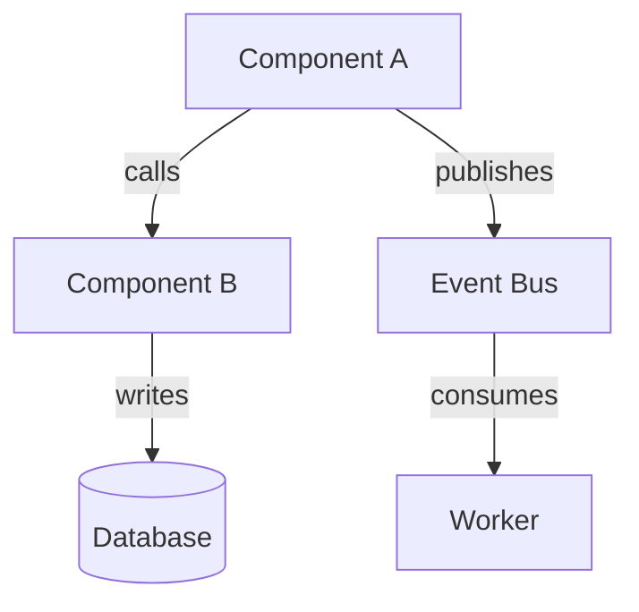
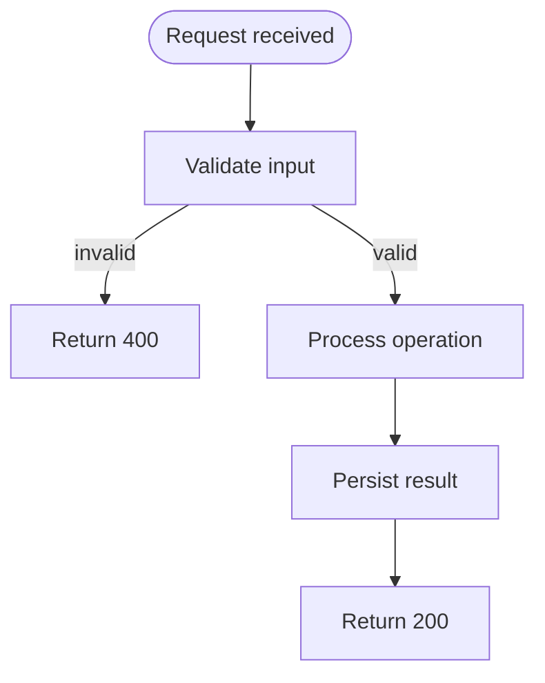
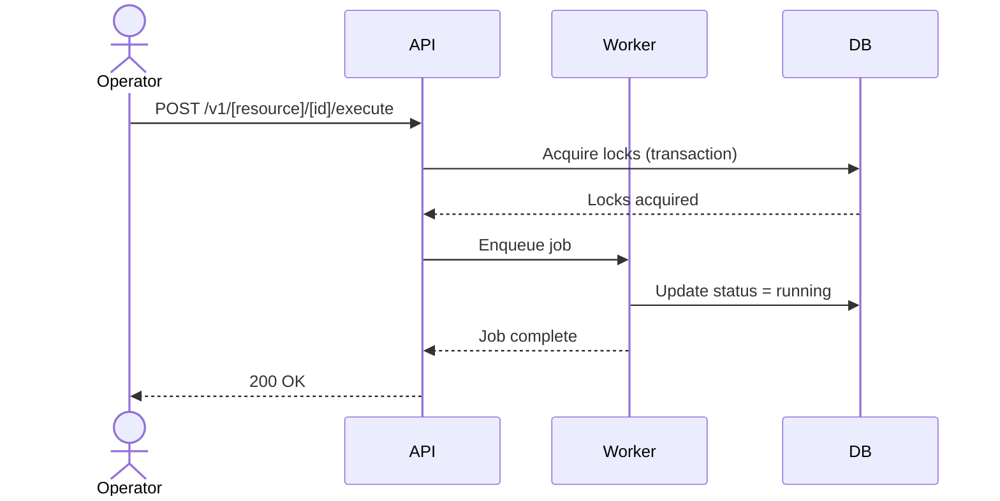
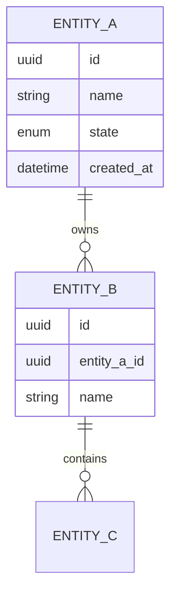
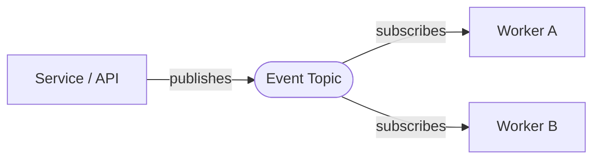

# [Service Name] Blueprint

> [!NOTE]
> **AI-Assisted Documentation**
> Portions of this document were drafted with the assistance of an AI language model (GitHub Copilot).
> Content has not yet been fully reviewed — this is a working design reference, not a final specification.
> AI-generated content may contain inaccuracies or omissions.
> When in doubt, defer to the source code, JSON schemas, and team consensus.

<!-- One-paragraph plain-language summary of what this service does, who operates it, and why it exists. -->

---

## Table of Contents

- [1) Core Concepts](#1-core-concepts)
- [2) Requirements](#2-requirements)
  - [Business Requirements](#business-requirements)
  - [Functional Requirements](#functional-requirements)
- [3) Architecture](#3-architecture)
  - [Components](#components)
- [4) Diagrams](#4-diagrams)
  - [Component Overview](#component-overview)
  - [Execution Flow](#execution-flow)
  - [Sequence Diagram](#sequence-diagram)
  - [Data Model (ER Diagram)](#data-model-er-diagram)
  - [Event-Driven Architecture](#event-driven-architecture)
- [5) Data Model](#5-data-model)
- [6) Execution Rules](#6-execution-rules)
- [7) Global Constraints](#7-global-constraints)
- [8) API Surface](#8-api-surface)
- [9) Logging & Audit](#9-logging--audit)
- [10) Admin Workflow](#10-admin-workflow)
- [11) Event-Driven Architecture](#11-event-driven-architecture)
- [12) References](#12-references)

---

## 1) Core Concepts

<!-- Define the primary domain entities that this service introduces. Be precise — these definitions become the shared vocabulary for all other documents. -->

### [Entity A]

<!-- Plain-language definition. Include: what it represents, who creates it, its lifecycle, and its relationship to other entities. -->

**States:** <!-- e.g., `online | offline` -->

**Key fields:** <!-- Bullet list of the most important fields and their purpose -->

---

### [Entity B]

<!-- Repeat the pattern for each core entity -->

---

## 2) Requirements

### Business Requirements

<!-- Business requirements express what operators/users can do with the system. Label each `B1`, `B2`, etc. -->

| # | Requirement |
|---|-------------|
| B1 | <!-- Operator-facing goal --> |
| B2 | <!-- Operator-facing goal --> |
| B3 | <!-- Add rows as needed --> |

---

### Functional Requirements

<!-- Functional requirements define system behaviors that satisfy business requirements. Group by domain area. Label `F1`, `F2`, etc. -->

#### [Domain Area 1]

| # | Requirement |
|---|-------------|
| F1 | <!-- System behavior --> |
| F2 | <!-- System behavior --> |

#### [Domain Area 2]

| # | Requirement |
|---|-------------|
| F3 | <!-- System behavior --> |
| F4 | <!-- System behavior --> |

<!-- Add more groups as needed -->

---

## 3) Architecture

### Components

<!-- Describe each major component: what it is, what it does, and how it interacts with the others. -->

| Component | Responsibility | Notes |
|-----------|---------------|-------|
| <!-- Name --> | <!-- What it does --> | <!-- Technology, deployment context, etc. --> |
| <!-- Name --> | <!-- What it does --> | |

---

## 4) Diagrams

### Component Overview

<!-- High-level view of system components and their relationships. -->

---

### Execution Flow

<!-- Step-by-step flow of the most important operation in the system (e.g., the main request path). -->

---

### Sequence Diagram

<!-- Show interactions between actors, services, and datastores for a critical workflow. -->

---

### Data Model (ER Diagram)

<!-- Entity-relationship diagram showing all tables and their associations. -->

---

### Event-Driven Architecture

<!-- If the service uses events/queues, show producers, topics, and consumers. Omit if not applicable. -->

---

## 5) Data Model

<!-- One section per database table / entity. For each, list fields with type, required flag, and description. -->

### `[table_name]`

<!-- Plain-language description of what this table stores. -->

| Field | Type | Required | Description |
|-------|------|----------|-------------|
| `id` | uuid | Yes | Unique identifier |
| `[field]` | [type] | Yes/No | <!-- Description --> |
| `created_at` | datetime | Yes | Record creation timestamp |
| `updated_at` | datetime | Yes | Last updated timestamp |

**`[field]` values** <!-- Repeat for every enum field -->

| Value | Description |
|-------|-------------|
| `[value]` | <!-- Meaning --> |

---

## 6) Execution Rules

<!-- Document the precise rules that govern the most critical operation (e.g., session execution, job processing). -->

### Effective Definition Resolution

<!-- How configuration/overrides are merged at runtime. -->

### Eligibility Rules

<!-- What conditions must be true before an operation proceeds. -->

### Failure Semantics

<!-- What happens when a step fails. Is it terminal? Does it roll back? -->

### Retry Semantics

<!-- What errors are retried, how many times, with what backoff. -->

### Cancellation

<!-- How an in-progress operation is stopped cleanly. -->

---

## 7) Global Constraints

<!-- Document hard system-wide invariants (e.g., concurrency rules, uniqueness constraints, capacity limits). -->

<!-- Example: -->
<!-- The same task cannot run concurrently in two separate sessions. This is enforced by acquiring all required locks in a single atomic DB transaction at execute time. -->

---

## 8) API Surface

<!-- High-level API listing grouped by resource. Full details belong in the corresponding DESIGN-*.md. -->

### [Resource Group 1]

| Method | Path | Description |
|--------|------|-------------|
| `POST` | `/v1/[resource]` | Create |
| `GET` | `/v1/[resource]` | List |
| `GET` | `/v1/[resource]/{id}` | Get by ID |
| `PUT` | `/v1/[resource]/{id}` | Full replace |
| `DELETE` | `/v1/[resource]/{id}` | Delete |

### [Resource Group 2]

| Method | Path | Description |
|--------|------|-------------|
| `POST` | `/v1/[resource]/{id}/[action]` | Perform action |

---

## 9) Logging & Audit

<!-- Describe what is persisted for auditability, what is redacted, and how operators surface history. -->

| What | Where stored | Notes |
|------|-------------|-------|
| <!-- Log type --> | <!-- Table or system --> | <!-- Retention, ownership, or access notes --> |

**Redacted fields:** <!-- List field names that must never appear in logs or audit records (e.g. credential paths, secret refs, PII). -->

---

## 10) Admin Workflow

<!-- Step-by-step narrative of what an operator does to set up and run the system end-to-end. -->

1. <!-- Step 1 -->
2. <!-- Step 2 -->
3. <!-- Add steps as needed -->

---

## 11) Event-Driven Architecture

<!-- Describe the events published by this service. Omit this section or mark N/A if the service is not event-driven. -->
<!-- Include a prose description of what events are published, what triggers them, and what downstream
     systems are expected to consume them. Full payload field definitions belong in DATA-DICTIONARY.md. -->

**Producer (all events):** <!-- Service name -->  
**Consumer(s):** <!-- Brief description of expected subscribers (e.g., downstream provisioning, billing, audit systems) -->

| Event | Trigger |
|-------|---------|
| `[event.name]` | <!-- API call or internal state transition that fires this event; include HTTP method/status where applicable --> |
| `[event.name]` | <!-- Add rows as needed --> |

---

## 12) References

### Project Documents

<!-- Link all DESIGN-*.md files -->
- [DESIGN-[AREA].md](../DESIGN-[AREA].md)

### JSON Schemas

<!-- Link all schemas in json-schema/ -->
- [`[entity].schema.json`](../json-schema/[entity].schema.json)

### External Resources

<!-- Standards docs, RFCs, relevant external documentation -->
- <!-- External link -->
