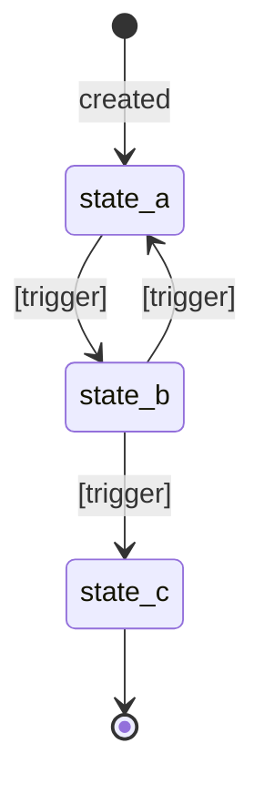

# [Area] Design: /v1/[resource]

> [!NOTE]
> **AI-Assisted Documentation**
> Portions of this document were drafted with the assistance of an AI language model (GitHub Copilot).
> Content has not yet been fully reviewed — this is a working design reference, not a final specification.
> AI-generated content may contain inaccuracies or omissions.
> When in doubt, defer to the source code, JSON schemas, and team consensus.

<!-- One-sentence description of what this document covers and how it relates to the Blueprint.
     Example: "This document describes how [entities] are created, managed, and used — and how [mechanism] enforces [constraint].
     It maps [area] behaviour to the functional requirements defined in [BLUEPRINT.md](BLUEPRINT.md)." -->

---

## Table of Contents

- [Overview](#overview)
- [Functional Requirements](#functional-requirements)
- [API Reference](#api-reference)
  - [POST /v1/[resource] — Create](#post-v1resource--create)
  - [GET /v1/[resource] — List](#get-v1resource--list)
  - [GET /v1/[resource]/{id} — Get](#get-v1resourceid--get)
  - [PUT /v1/[resource]/{id} — Replace](#put-v1resourceid--replace)
  - [DELETE /v1/[resource]/{id} — Delete](#delete-v1resourceid--delete)
  - [POST /v1/[resource]/{id}/[action] — [Action Name]](#post-v1resourceidaction--action-name)
- [State Machine](#state-machine)
- [[Feature / Concept A]](#feature--concept-a)
- [[Feature / Concept B]](#feature--concept-b)
- [Use Cases](#use-cases)
- [Important Constraints](#important-constraints)

---

## Overview

<!-- 2–4 paragraphs:
     1. What this area/resource does and its role in the broader system.
     2. Its relationship to other areas (link to related DESIGN-*.md).
     3. The two or three responsibilities this document governs. -->

---

## Functional Requirements

<!-- Table tracing each requirement ID from BLUEPRINT.md to its concrete implementation in this document.
     Every F# that this design document satisfies must appear in this table. -->

| # | Requirement | Satisfied by |
|---|-------------|-------------|
| [F1](BLUEPRINT.md#f1) | <!-- Copy requirement text from Blueprint --> | <!-- How this design satisfies it: endpoint, field, rule --> |
| [F2](BLUEPRINT.md#f2) | | |

---

## API Reference

<!-- One sub-section per endpoint. Include: method + path, description, request body schema,
     success response, and all relevant error responses. -->

---

### POST /v1/[resource] — Create

**Description:** <!-- What this endpoint does -->

**Request body** (`application/json`)

```jsonc
{
  "field1": "string",      // required — description
  "field2": 0,             // required — description
  "optionalField": "value" // optional — description
}
```

**Success response** — `201 Created`

```jsonc
{
  "id": "uuid",
  "field1": "string",
  "createdAt": "ISO 8601 datetime"
}
```

**Error responses**

| Status | Code | Condition |
|--------|------|-----------|
| `400` | `VALIDATION_ERROR` | Missing required field or invalid value |
| `409` | `[RESOURCE]_ALREADY_EXISTS` | <!-- Uniqueness conflict description --> |

---

### GET /v1/[resource] — List

**Description:** Returns a paginated list of all `[resource]` records.

**Query parameters**

| Parameter | Type | Default | Description |
|-----------|------|---------|-------------|
| `limit` | integer | 50 | Max records to return |
| `offset` | integer | 0 | Pagination offset |

**Success response** — `200 OK`

```jsonc
{
  "data": [ /* array of [resource] objects */ ],
  "total": 0
}
```

---

### GET /v1/[resource]/{id} — Get

**Description:** Returns a single `[resource]` by ID.

**Path parameters**

| Parameter | Description |
|-----------|-------------|
| `id` | UUID of the `[resource]` |

**Success response** — `200 OK`

**Error responses**

| Status | Code | Condition |
|--------|------|-----------|
| `404` | `[RESOURCE]_NOT_FOUND` | No record with the given ID |

---

### PUT /v1/[resource]/{id} — Replace

**Description:** Full replacement of an existing `[resource]`. The resource must already exist. All mutable fields must be provided.

**Request body** — Same shape as `POST`.

**Error responses**

| Status | Code | Condition |
|--------|------|-----------|
| `404` | `[RESOURCE]_NOT_FOUND` | Resource does not exist |
| `400` | `VALIDATION_ERROR` | Invalid payload |

---

### DELETE /v1/[resource]/{id} — Delete

**Description:** <!-- Delete semantics: hard delete? soft delete? cascade behavior? -->

**Error responses**

| Status | Code | Condition |
|--------|------|-----------|
| `404` | `[RESOURCE]_NOT_FOUND` | Resource does not exist |
| `409` | `[RESOURCE]_IN_USE` | <!-- Resource cannot be deleted while referenced elsewhere --> |

---

### POST /v1/[resource]/{id}/[action] — [Action Name]

**Description:** <!-- What this action does and when it is used -->

**Request body** (`application/json`)

```jsonc
{
  "[actionField]": "[value]" // required — description
}
```

**Success response** — `200 OK`

**Error responses**

| Status | Code | Condition |
|--------|------|-----------|
| `404` | `[RESOURCE]_NOT_FOUND` | Resource does not exist |
| `422` | `INVALID_STATE_TRANSITION` | Action not allowed in current state |

---

## State Machine

<!-- If this resource has states, document the allowed transitions here. -->



**State descriptions**

| State | Description | Entry trigger | Allowed next states |
|-------|-------------|---------------|---------------------|
| `state_a` | <!-- What it means --> | <!-- What causes entry --> | `state_b` |
| `state_b` | | | `state_a`, `state_c` |
| `state_c` | Terminal | | — |

---

## [Feature / Concept A]

<!-- Deep-dive section for a specific feature, field group, or operational concept in this area.
     Examples: "Cache priority", "Retry policy", "selectedOps", "Lock lifecycle"
     Include: definition, rules, examples, edge cases. -->

---

## [Feature / Concept B]

<!-- Repeat pattern for additional features/concepts -->

---

## Use Cases

<!-- One sub-section per use case. Use a consistent label: [AREA]-UC[N] (e.g., SVC-UC1).
     Reference these labels in the Requirements Matrix. -->

### [AREA]-UC1: [Use Case Name]

**Actor:** <!-- Who performs this -->  
**Precondition:** <!-- System state required before this can happen -->  
**Steps:**
1. <!-- Step 1 -->
2. <!-- Step 2 -->

**Postcondition:** <!-- Expected system state after completion -->  
**Requirement(s) satisfied:** [F1](BLUEPRINT.md#f1), [F2](BLUEPRINT.md#f2)

---

### [AREA]-UC2: [Use Case Name]

**Actor:**  
**Precondition:**  
**Steps:**
1.
2.

**Postcondition:**  
**Requirement(s) satisfied:**

---

## Important Constraints

<!-- Hard rules, invariants, and operational limits that implementers must not violate.
     These should be stated as MUST / MUST NOT / SHOULD / SHOULD NOT. -->

- **[Constraint 1]:** <!-- Precise rule. E.g.: "PUT MUST be a full replace — partial updates are not supported." -->
- **[Constraint 2]:** <!-- -->
- **[Constraint 3]:** <!-- -->

<!-- Link to related design docs -->

**See also:**
- [BLUEPRINT.md](../BLUEPRINT.md) — requirements this design satisfies
- [DESIGN-[RELATED].md](../DESIGN-[RELATED].md) — <!-- how it relates -->
