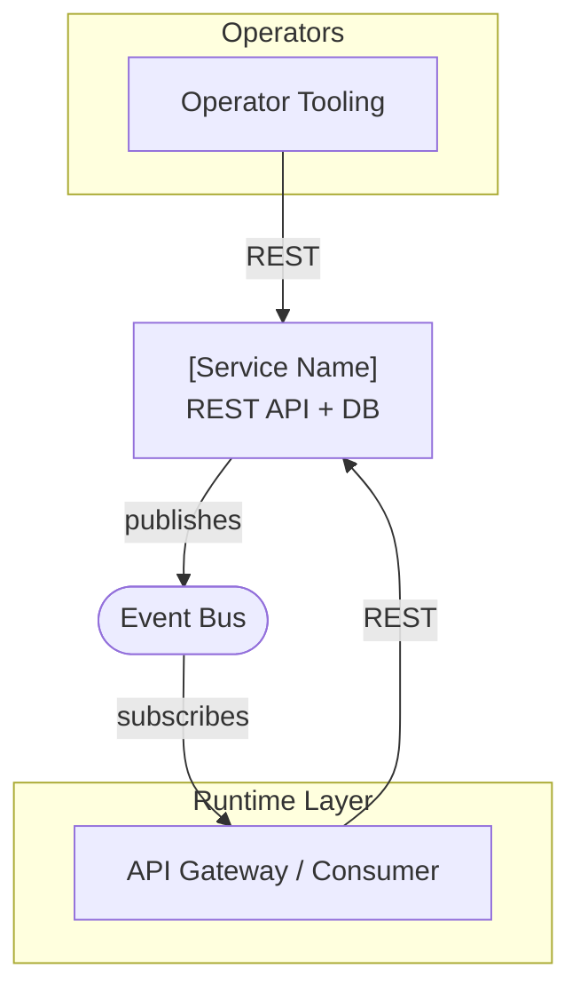
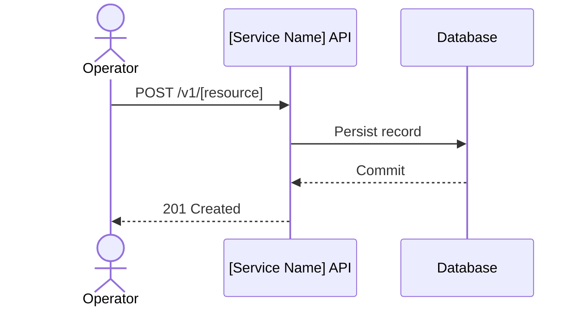

# Solution Architecture: [Service Name]

> [!NOTE]
> **AI-Assisted Documentation**
> Portions of this document were drafted with the assistance of an AI language model (GitHub Copilot).
> Content has not yet been fully reviewed. This is a working design reference, not a final specification.
> AI-generated content may contain inaccuracies or omissions.
> When in doubt, defer to the source code, JSON schemas, and team consensus.

<!-- One or two sentences describing what this document covers and how it relates to BLUEPRINT.md.
     BLUEPRINT.md covers the data model and API surface. This document covers topologies:
     who calls what, how external systems interface with this service, and how architectural
     decisions shape interaction patterns. -->

---

## Table of Contents

- [1. Architectural Positioning](#1-architectural-positioning)
- [2. System Boundary and External Actors](#2-system-boundary-and-external-actors)
- [3. Logical Topologies](#3-logical-topologies)
  - [3.1 [Topology Name]](#31-topology-name)
  - [3.2 [Topology Name]](#32-topology-name)
  <!-- Add more topology sub-sections as needed -->
- [4. Interface Catalogue](#4-interface-catalogue)
- [5. Risk-Architecture Traceability](#5-risk-architecture-traceability)
- [6. Key Architectural Constraints](#6-key-architectural-constraints)
- [7. References](#7-references)

---

## 1. Architectural Positioning

<!-- Describe the role this service plays in the broader system:
     - Is it a control plane, data plane, or gateway?
     - Does it hold business logic or is it purely operational?
     - What is the authoritative source of truth it maintains?
     - Who operates it and at what frequency? -->

<!-- List the primary consumer classes and how they interact with this service. -->

| Consumer Class | Interaction Mode | Notes |
|---|---|---|
| <!-- Consumer type --> | <!-- Sync REST / Async event / Hybrid --> | <!-- Frequency, latency sensitivity, or constraint references --> |

---

## 2. System Boundary and External Actors

<!-- High-level component diagram showing this service and all external actors that produce or consume from it. -->

---

## 3. Logical Topologies

<!-- Each sub-section is a named topology — a specific interaction pattern between actors and this service.
     Common topologies: control-plane (operator CRUD), onboarding pipeline, runtime request path,
     event-driven, enforcement (quota / residency), and future/proposed federation.
     Use sequence diagrams to show the message flow for the critical path in each topology.
     End each topology with a Key Constraints list. -->

### 3.1 [Topology Name]

<!-- Describe the interaction class this topology covers (who calls, what they do, at what frequency). -->

**Key constraints:**
- <!-- Constraint on this topology: e.g., mutation blocked when status=provisioning -->
- <!-- Reference decisions or risks by their AD-## / RK-## identifier where applicable -->

---

### 3.2 [Topology Name]

<!-- Repeat the pattern for each additional topology. -->

---

## 4. Interface Catalogue

<!-- One row per integration point between this service and external systems.
     Columns:
     - Interface: name of the external system or actor
     - Direction: Inbound to this service | Outbound from this service | Bidirectional
     - Channel: REST API | Event Bus | gRPC | etc.
     - Payload / Contract: what is exchanged (request, event, etc.)
     - Risk/Decision refs: AD-## / RK-## that govern this interface -->

| Interface | Direction | Channel | Payload / Contract | Risk / Decision |
|---|---|---|---|---|
| <!-- External system --> | <!-- Inbound \| Outbound \| Bidirectional --> | <!-- REST \| Event Bus \| etc. --> | <!-- What flows across --> | <!-- RK-##, AD-## --> |

---

## 5. Risk-Architecture Traceability

<!-- Map each topology section to the risks and decisions from RISKS-AND-DECISIONS.md that it addresses.
     This table exists to help readers navigate between the two documents.
     The canonical risk register and AD entries live in RISKS-AND-DECISIONS.md. -->

| Section | Risks and Decisions Addressed |
|---|---|
| §3.1 [Topology Name] | <!-- AD-##, RK-## --> |
| §3.2 [Topology Name] | <!-- AD-##, RK-## --> |

---

## 6. Key Architectural Constraints

<!-- List cross-cutting constraints that apply to all topologies and all integrations.
     Each row is one constraint that implementers and integrators MUST respect.
     These should be the hardest, most load-bearing invariants — not implementation options. -->

| Constraint | Rationale |
|---|---|
| <!-- One-sentence constraint (use MUST / MUST NOT language) --> | <!-- Why — reference AD-## or RK-## --> |

---

## 7. References

- [BLUEPRINT.md](../BLUEPRINT.md) — Core data model, API surface, execution rules, and event catalogue
- [RISKS-AND-DECISIONS.md](../RISKS-AND-DECISIONS.md) — Architectural decisions and risk mitigations
- [REQUIREMENTS-MATRIX.md](../REQUIREMENTS-MATRIX.md) — Business and functional requirement traceability
- [DATA-DICTIONARY.md](../DATA-DICTIONARY.md) — Canonical field-level definitions and event payloads
<!-- Add links to applicable DESIGN-*.md documents -->
