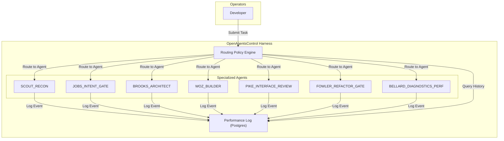
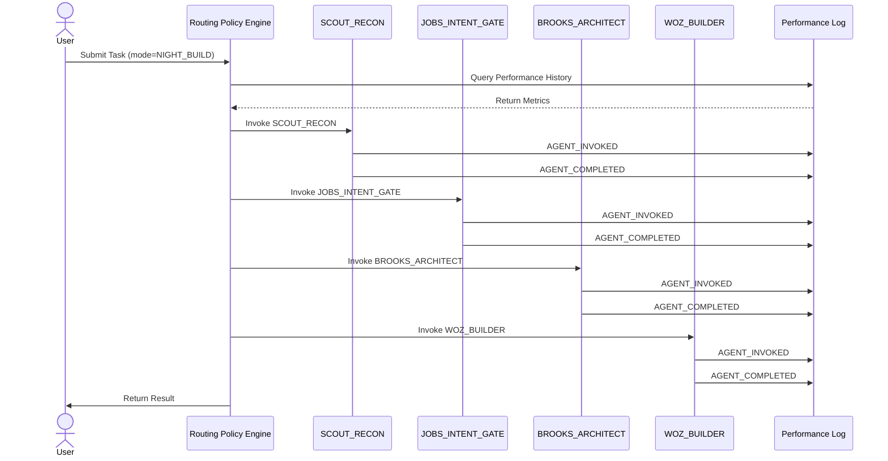
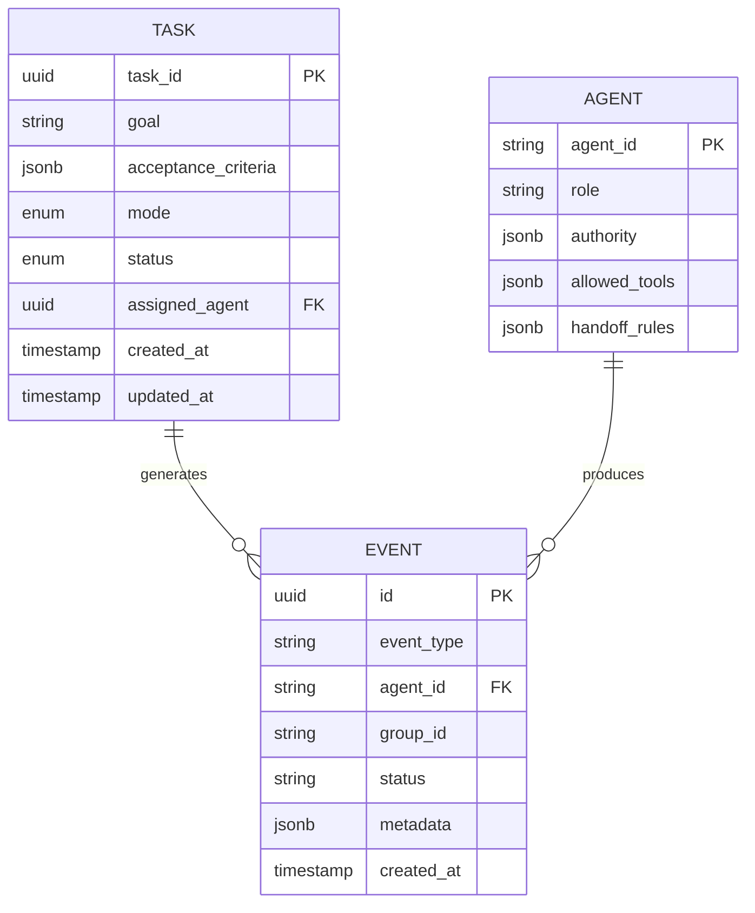
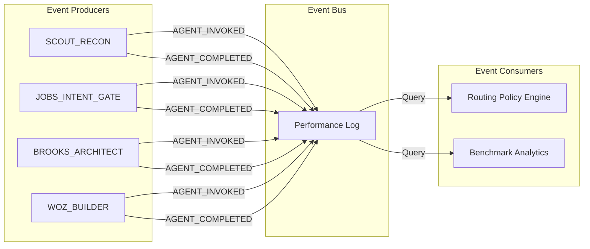

# OpenAgentsControl Harness Blueprint

> [!NOTE]
> **AI-Assisted Documentation**
> Portions of this document were drafted with the assistance of an AI language model (GitHub Copilot).
> Content has not yet been fully reviewed — this is a working design reference, not a final specification.
> AI-generated content may contain inaccuracies or omissions.
> When in doubt, defer to the source code, JSON schemas, and team consensus.

The OpenAgentsControl Harness is a deterministic multi-agent orchestration system that coordinates specialized AI agents to execute software development tasks with minimal hesitation, clear routing, and continuous learning. It operates in two modes: DAY_BUILD (interactive with approval gates) and NIGHT_BUILD (no-brakes deterministic execution).

---

## Table of Contents

- [1) Core Concepts](#1-core-concepts)
- [2) Requirements](#2-requirements)
  - [Business Requirements](#business-requirements)
  - [Functional Requirements](#functional-requirements)
- [3) Architecture](#3-architecture)
  - [Components](#components)
- [4) Diagrams](#4-diagrams)
  - [Component Overview](#component-overview)
  - [Execution Flow](#execution-flow)
  - [Sequence Diagram](#sequence-diagram)
  - [Data Model (ER Diagram)](#data-model-er-diagram)
  - [Event-Driven Architecture](#event-driven-architecture)
- [5) Data Model](#5-data-model)
- [6) Execution Rules](#6-execution-rules)
- [7) Global Constraints](#7-global-constraints)
- [8) API Surface](#8-api-surface)
- [9) Logging & Audit](#9-logging--audit)
- [10) Admin Workflow](#10-admin-workflow)
- [11) Event-Driven Architecture](#11-event-driven-architecture)
- [12) References](#12-references)

---

## 1) Core Concepts

### Agent

An Agent is a specialized AI persona with defined authority, allowed tools, and handoff rules. Agents are invoked by the routing policy based on task type and performance history.

**States:** `idle | active | blocked | completed | failed`

**Key fields:**
- `agent_id` — Unique identifier (e.g., `scout_recon`, `woz_builder`)
- `role` — Functional role (e.g., "Discovery", "Implementation", "Architecture")
- `authority` — Decision-making scope
- `allowed_tools` — Tools this agent may invoke
- `handoff_rules` — Conditions for delegating to other agents

### Task

A Task is a unit of work submitted to the harness. It has a goal, acceptance criteria, and a lifecycle from submission to completion.

**States:** `pending | planning | executing | validating | completed | failed | blocked`

**Key fields:**
- `task_id` — Unique identifier
- `goal` — Plain-language description of what must be achieved
- `acceptance_criteria` — Testable conditions for completion
- `mode` — `DAY_BUILD` or `NIGHT_BUILD`
- `status` — Current state
- `assigned_agent` — Agent currently responsible

### Performance Log

The Performance Log is a structured record of agent invocations, task completions, and failures. It drives deterministic routing decisions and continuous improvement.

**Key fields:**
- `event_type` — Type of event (e.g., `AGENT_INVOKED`, `TASK_COMPLETE`)
- `agent_id` — Agent responsible
- `status` — Outcome
- `metadata` — Additional context (duration, errors, etc.)

### Routing Policy

The Routing Policy is a deterministic rule set that selects the best agent for a given task type based on performance history and role constraints.

**Key fields:**
- `task_type` — Category of work (e.g., "Discovery", "Implementation")
- `primary_agent` — First-choice agent
- `fallback_agent` — Backup agent if primary fails
- `condition` — When to apply this route

---

## 2) Requirements

### Business Requirements

| # | Requirement |
|---|-------------|
| B1 | Operators can submit tasks to the harness and receive deterministic execution without manual intervention in NIGHT_BUILD mode |
| B2 | Operators can run tasks interactively with approval gates in DAY_BUILD mode |
| B3 | The harness learns from execution history to improve routing decisions over time |
| B4 | All agent actions are logged for audit and performance analysis |
| B5 | The harness enforces role boundaries and prevents unauthorized tool usage |
| B6 | The harness stops on hard blockers or destructive changes requiring approval |

---

### Functional Requirements

#### Task Management

| # | Requirement |
|---|-------------|
| F1 | The system MUST accept task submissions with goal, acceptance criteria, and mode |
| F2 | The system MUST route tasks to the appropriate agent based on task type and routing policy |
| F3 | The system MUST track task lifecycle from pending to completed/failed |
| F4 | The system MUST support both DAY_BUILD and NIGHT_BUILD execution modes |

#### Agent Orchestration

| # | Requirement |
|---|-------------|
| F5 | The system MUST invoke agents according to the routing policy |
| F6 | The system MUST enforce agent authority boundaries (allowed tools, handoff rules) |
| F7 | The system MUST log all agent invocations with event type, agent ID, status, and metadata |
| F8 | The system MUST support fallback routing when primary agent fails |

#### Performance Logging

| # | Requirement |
|---|-------------|
| F9 | The system MUST record all performance events to Postgres via MCP_DOCKER tools |
| F10 | The system MUST support event types: TASK_START, TASK_COMPLETE, TASK_FAILED, AGENT_INVOKED, AGENT_COMPLETED, AGENT_FAILED, FALLBACK_TRIGGERED, BLOCKER_HIT, APPROVAL_REQUESTED, APPROVAL_GRANTED, APPROVAL_DENIED |
| F11 | The system MUST provide queryable metrics for reliability, speed, and quality benchmarks |

#### Documentation Compliance

| # | Requirement |
|---|-------------|
| F12 | All agents MUST load AI-GUIDELINES.md as required context before execution |
| F13 | All agents MUST produce documentation artifacts following AI-GUIDELINES.md templates |
| F14 | The system MUST validate documentation completeness as part of DoD |

---

## 3) Architecture

### Components

**SCOUT_RECON** — Discovery agent responsible for producing Scout Reports (paths, entrypoints, mismatches, risks). Invoked first in every run loop.

**JOBS_INTENT_GATE** — Intent and scope agent responsible for producing Intent Briefs and Acceptance Criteria. Blocks execution until signed.

**BROOKS_ARCHITECT** — Architecture agent responsible for contracts, ADRs, and final routing policy. Final sign-off on architectural decisions.

**WOZ_BUILDER** — Implementation agent responsible for executing fixes and features. Primary builder.

**PIKE_INTERFACE_REVIEW** — Interface gate agent responsible for rejecting unnecessary surface area. Ensures simplicity.

**FOWLER_REFACTOR_GATE** — Refactor gate agent responsible for preventing debt accumulation. Ensures maintainability.

**BELLARD_DIAGNOSTICS_PERF** — Performance and diagnostics agent responsible for measurement-first optimization. Invoked only when perf/low-level constraints apply.

**Performance Log (Postgres)** — Structured event storage accessed via MCP_DOCKER tools.

**Routing Policy Engine** — Deterministic rule engine that selects agents based on task type and performance history.

---

## 4) Diagrams

### Component Overview



### Execution Flow



### Data Model (ER Diagram)



### Event-Driven Architecture



---

## 5) Data Model

### tasks

| Field | Type | Required | Description |
|-------|------|----------|-------------|
| `task_id` | uuid | Yes | Unique identifier |
| `goal` | text | Yes | Plain-language description |
| `acceptance_criteria` | jsonb | Yes | Testable conditions for completion |
| `mode` | enum | Yes | `DAY_BUILD` or `NIGHT_BUILD` |
| `status` | enum | Yes | `pending | planning | executing | validating | completed | failed | blocked` |
| `assigned_agent` | uuid | No | Currently responsible agent |
| `created_at` | timestamp | Yes | Record creation timestamp (UTC) |
| `updated_at` | timestamp | Yes | Last updated timestamp (UTC) |

### agents

| Field | Type | Required | Description |
|-------|------|----------|-------------|
| `agent_id` | string | Yes | Unique identifier (e.g., `scout_recon`) |
| `role` | string | Yes | Functional role |
| `authority` | jsonb | Yes | Decision-making scope |
| `allowed_tools` | jsonb | Yes | Tools this agent may invoke |
| `handoff_rules` | jsonb | Yes | Conditions for delegating to other agents |

### events

| Field | Type | Required | Description |
|-------|------|----------|-------------|
| `id` | serial | Yes | Auto-incrementing ID |
| `event_type` | varchar(100) | Yes | Type of event |
| `group_id` | varchar(100) | Yes | Grouping identifier (e.g., task ID) |
| `agent_id` | varchar(100) | Yes | Agent responsible |
| `status` | varchar(50) | Yes | Outcome |
| `metadata` | jsonb | No | Additional context |
| `created_at` | timestamp | Yes | Event timestamp (UTC) |

---

## 6) Execution Rules

### Ordering

1. **SCOUT_RECON** MUST run first to produce Scout Report
2. **JOBS_INTENT_GATE** MUST run second to produce Intent Brief + Acceptance Criteria
3. **BROOKS_ARCHITECT** MUST run third to produce Contracts/ADRs and select route
4. **WOZ_BUILDER** MUST run fourth to implement step-by-step with validations
5. **PIKE_INTERFACE_REVIEW** MUST run fifth to reject unnecessary surface area
6. **FOWLER_REFACTOR_GATE** MUST run sixth to prevent debt accumulation
7. **BELLARD_DIAGNOSTICS_PERF** MUST run only if perf/low-level constraints apply

### Eligibility

- A task is eligible for execution if:
  - Goal is defined
  - Acceptance criteria are testable
  - Mode is specified (DAY_BUILD or NIGHT_BUILD)
  - No hard blockers exist

### Failure Semantics

- If primary agent fails → log `AGENT_FAILED` → try fallback agent
- If no fallback → escalate to BROOKS_ARCHITECT
- If BROOKS_ARCHITECT fails → log `BLOCKER_HIT` → stop (hard blocker)

### Retry

- In NIGHT_BUILD mode: automatic retry with fallback agent
- In DAY_BUILD mode: stop and request user approval

### Cancellation

- User can cancel task at any time
- System logs `TASK_FAILED` with cancellation reason

---

## 7) Global Constraints

### Determinism

- Routing policy MUST choose ONE best route based on Performance Log + role constraints
- Multiple approaches MUST NOT be proposed unless:
  - Performance evidence is inconclusive, OR
  - Architecture is ambiguous, OR
  - Destructive decision is required

### Documentation Compliance

- All agents MUST load AI-GUIDELINES.md as required context
- All agents MUST produce documentation artifacts following AI-GUIDELINES.md templates
- DoD MUST include documentation completeness validation

### Performance Logging

- Every agent invocation MUST log `AGENT_INVOKED` + `AGENT_COMPLETED` or `AGENT_FAILED`
- Every task MUST log `TASK_START` + `TASK_COMPLETE` or `TASK_FAILED`
- Fallbacks MUST log `FALLBACK_TRIGGERED`
- Blockers MUST log `BLOCKER_HIT`

### Role Boundaries

- Agents MUST NOT invoke tools outside their `allowed_tools` list
- Agents MUST NOT exceed their `authority` scope
- Agents MUST follow `handoff_rules` for delegation

---

## 8) API Surface

### Task Submission

**POST /v1/tasks** — Submit a new task

**Request body:**
```json
{
  "goal": "string",
  "acceptance_criteria": ["string"],
  "mode": "DAY_BUILD | NIGHT_BUILD"
}
```

**Success response:** `201 Created`

```json
{
  "task_id": "uuid",
  "status": "pending",
  "created_at": "ISO 8601 datetime"
}
```

### Task Status

**GET /v1/tasks/{task_id}** — Get task status

**Success response:** `200 OK`

```json
{
  "task_id": "uuid",
  "goal": "string",
  "status": "string",
  "assigned_agent": "string",
  "created_at": "ISO 8601 datetime",
  "updated_at": "ISO 8601 datetime"
}
```

### Performance Metrics

**GET /v1/metrics** — Query performance metrics

**Query parameters:**
- `agent_id` — Filter by agent
- `event_type` — Filter by event type
- `start_date` — Start of date range
- `end_date` — End of date range

**Success response:** `200 OK`

```json
{
  "metrics": [
    {
      "event_type": "string",
      "agent_id": "string",
      "count": 0,
      "avg_duration_ms": 0
    }
  ]
}
```

---

## 9) Logging & Audit

### What is Persisted

- All agent invocations (`AGENT_INVOKED`, `AGENT_COMPLETED`, `AGENT_FAILED`)
- All task lifecycle events (`TASK_START`, `TASK_COMPLETE`, `TASK_FAILED`)
- All routing decisions (`FALLBACK_TRIGGERED`, `BLOCKER_HIT`)
- All approval requests (`APPROVAL_REQUESTED`, `APPROVAL_GRANTED`, `APPROVAL_DENIED`)

### What is Redacted

- No sensitive data (passwords, API keys) in metadata
- No PII in log entries

### How it is Surfaced

- Queryable via Postgres (MCP_DOCKER tools)
- Exportable for analytics (benchmark dashboards)

---

## 10) Admin Workflow

### Adding a New Agent

1. Define agent in `.opencode/agent/core/` or `.opencode/agent/subagents/`
2. Add agent metadata to `.opencode/config/agent-metadata.json`
3. Define routing policy entry in `DESIGN-ROUTING.md`
4. Update `REQUIREMENTS-MATRIX.md` with new agent responsibilities

### Updating Routing Policy

1. Modify routing table in `DESIGN-ROUTING.md`
2. Update `RISKS-AND-DECISIONS.md` with rationale
3. Validate via benchmark tests

### Changing Performance Log Schema

1. Create migration in `.opencode/migrations/`
2. Update `DATA-DICTIONARY.md` with new fields
3. Update `DESIGN-LOGGING.md` with new event types

---

## 11) Event-Driven Architecture

### Event Types

| Event Type | Producer | Consumer | Purpose |
|------------|----------|----------|---------|
| `TASK_START` | Routing Policy Engine | Performance Log | Mark task beginning |
| `TASK_COMPLETE` | Routing Policy Engine | Performance Log | Mark task success |
| `TASK_FAILED` | Routing Policy Engine | Performance Log | Mark task failure |
| `AGENT_INVOKED` | Agent | Performance Log | Mark agent invocation |
| `AGENT_COMPLETED` | Agent | Performance Log | Mark agent success |
| `AGENT_FAILED` | Agent | Performance Log | Mark agent failure |
| `FALLBACK_TRIGGERED` | Routing Policy Engine | Performance Log | Mark fallback routing |
| `BLOCKER_HIT` | Routing Policy Engine | Performance Log | Mark hard blocker |
| `APPROVAL_REQUESTED` | Agent | Performance Log | Mark approval request |
| `APPROVAL_GRANTED` | User | Performance Log | Mark approval granted |
| `APPROVAL_DENIED` | User | Performance Log | Mark approval denied |

---

## 12) References

- [AI-GUIDELINES.md](.opencode/AI-GUIDELINES.md) — Documentation standards
- [SOLUTION-ARCHITECTURE.md](SOLUTION-ARCHITECTURE.md) — Topological view
- [DESIGN-ROUTING.md](DESIGN-ROUTING.md) — Routing policy design
- [DESIGN-LOGGING.md](DESIGN-LOGGING.md) — Performance logging design
- [REQUIREMENTS-MATRIX.md](REQUIREMENTS-MATRIX.md) — Requirements traceability
- [RISKS-AND-DECISIONS.md](RISKS-AND-DECISIONS.md) — Architectural decisions
- [DATA-DICTIONARY.md](DATA-DICTIONARY.md) — Field-level reference