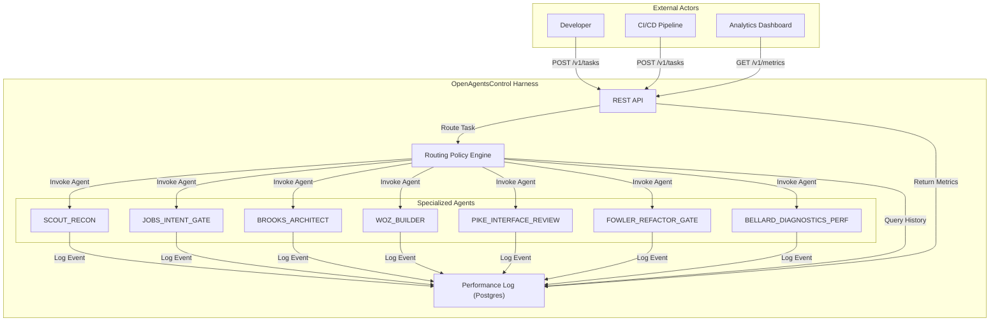
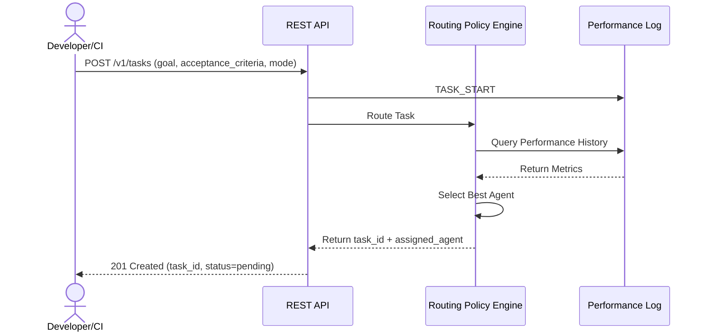
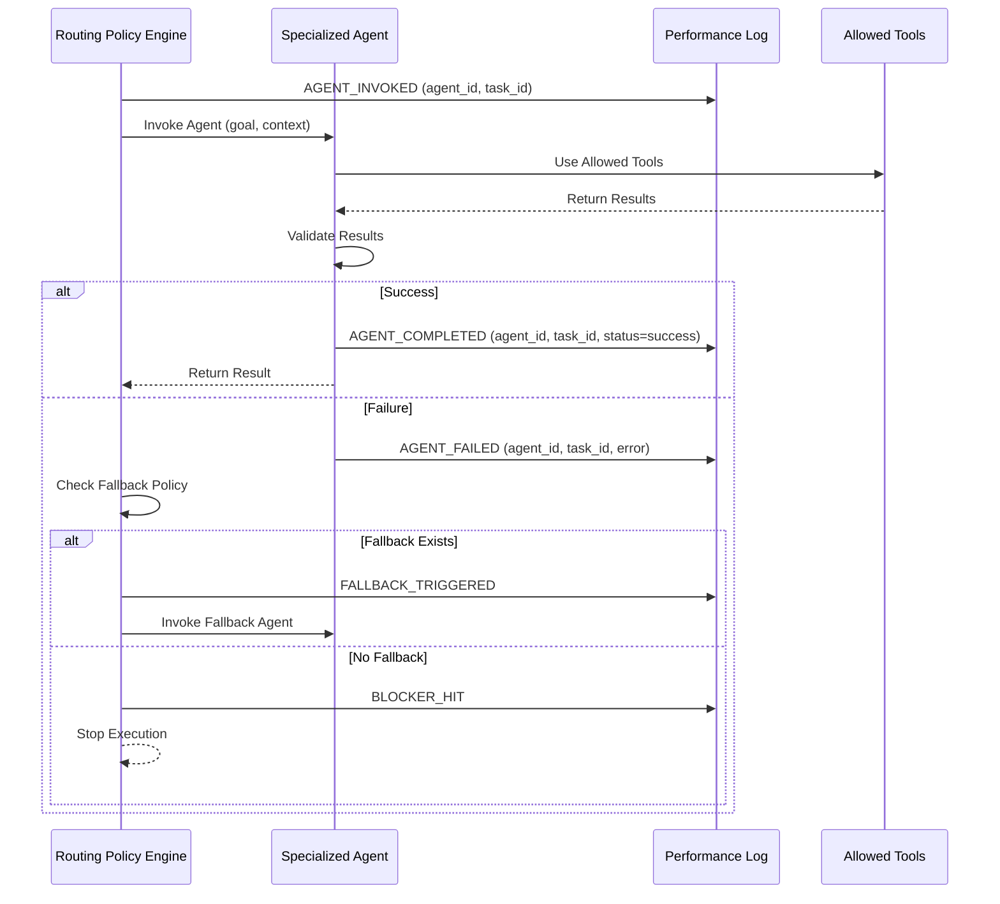
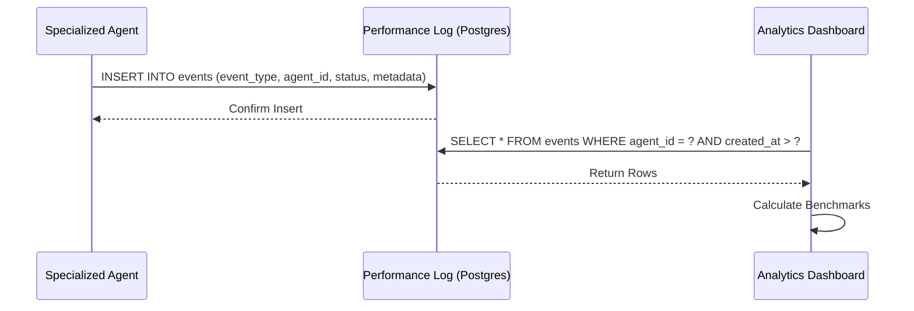
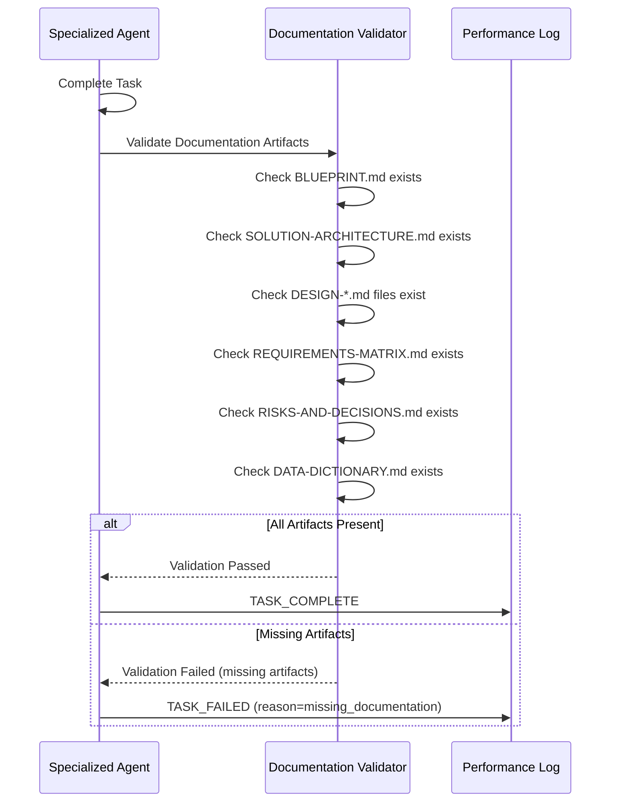

# Solution Architecture: OpenAgentsControl Harness

> [!NOTE]
> **AI-Assisted Documentation**
> Portions of this document were drafted with the assistance of an AI language model (GitHub Copilot).
> Content has not yet been fully reviewed. This is a working design reference, not a final specification.
> AI-generated content may contain inaccuracies or omissions.
> When in doubt, defer to the source code, JSON schemas, and team consensus.

This document describes how the OpenAgentsControl Harness is structured from a topological perspective — who calls what, how external actors interface with the system, and how architectural decisions shape interaction patterns. It complements the Blueprint's data-and-API view with a system-of-systems view.

---

## Table of Contents

- [1. Architectural Positioning](#1-architectural-positioning)
- [2. System Boundary and External Actors](#2-system-boundary-and-external-actors)
- [3. Logical Topologies](#3-logical-topologies)
  - [3.1 Task Submission Topology](#31-task-submission-topology)
  - [3.2 Agent Execution Topology](#32-agent-execution-topology)
  - [3.3 Performance Logging Topology](#33-performance-logging-topology)
  - [3.4 Documentation Validation Topology](#34-documentation-validation-topology)
- [4. Interface Catalogue](#4-interface-catalogue)
- [5. Risk-Architecture Traceability](#5-risk-architecture-traceability)
- [6. Key Architectural Constraints](#6-key-architectural-constraints)
- [7. References](#7-references)

---

## 1. Architectural Positioning

The OpenAgentsControl Harness is a **control plane** for multi-agent orchestration. It does not hold business logic itself — it coordinates specialized AI agents that execute software development tasks. The authoritative source of truth it maintains is the **Performance Log**, which drives deterministic routing decisions.

| Consumer Class | Interaction Mode | Notes |
|---|---|---|
| Developer | Sync REST | Submits tasks via CLI or API, receives results synchronously |
| CI/CD Pipeline | Sync REST | Submits tasks in NIGHT_BUILD mode, expects deterministic execution |
| Agent | Async event | Invoked by routing policy, logs events to Performance Log |
| Analytics Dashboard | Sync REST | Queries Performance Log for benchmark metrics |

---

## 2. System Boundary and External Actors

---

## 3. Logical Topologies

### 3.1 Task Submission Topology

This topology covers how developers and CI/CD pipelines submit tasks to the harness.

**Key constraints:**
- Task MUST have goal, acceptance_criteria, and mode defined
- Task MUST be logged as `TASK_START` before routing
- Routing decision MUST be based on Performance Log history

---

### 3.2 Agent Execution Topology

This topology covers how agents are invoked, execute, and log events.

**Key constraints:**
- Agent MUST log `AGENT_INVOKED` before execution
- Agent MUST log `AGENT_COMPLETED` or `AGENT_FAILED` after execution
- Agent MUST NOT use tools outside `allowed_tools` list
- Router MUST check fallback policy on failure

---

### 3.3 Performance Logging Topology

This topology covers how events are persisted and queried for analytics.

**Key constraints:**
- All events MUST be persisted to Postgres via MCP_DOCKER tools
- Events MUST include `event_type`, `agent_id`, `group_id`, `status`, `metadata`
- Query interface MUST support filtering by agent, event type, and date range

---

### 3.4 Documentation Validation Topology

This topology covers how documentation compliance is validated as part of DoD.

**Key constraints:**
- Documentation validation MUST run before `TASK_COMPLETE` is logged
- All required artifacts (per AI-GUIDELINES.md) MUST be present
- Missing artifacts MUST result in `TASK_FAILED`

---

## 4. Interface Catalogue

| Direction | Channel | Payload | References |
|-----------|---------|---------|------------|
| Developer → Harness | REST POST /v1/tasks | `{goal, acceptance_criteria, mode}` | [BLUEPRINT.md §8](BLUEPRINT.md#8-api-surface) |
| Harness → Developer | REST 201 Created | `{task_id, status, created_at}` | [BLUEPRINT.md §8](BLUEPRINT.md#8-api-surface) |
| Harness → Agent | Async invocation | `{goal, context, allowed_tools}` | [DESIGN-ROUTING.md](DESIGN-ROUTING.md) |
| Agent → Harness | Async event | `{event_type, agent_id, status, metadata}` | [DESIGN-LOGGING.md](DESIGN-LOGGING.md) |
| Dashboard → Harness | REST GET /v1/metrics | Query params: `agent_id, event_type, start_date, end_date` | [BLUEPRINT.md §8](BLUEPRINT.md#8-api-surface) |
| Harness → Dashboard | REST 200 OK | `{metrics: [{event_type, agent_id, count, avg_duration_ms}]}` | [BLUEPRINT.md §8](BLUEPRINT.md#8-api-surface) |

---

## 5. Risk-Architecture Traceability

| Topology | AD/RK Entry | How Architecture Addresses Risk |
|----------|-------------|--------------------------------|
| Task Submission | AD-01: Deterministic Routing Policy | Ensures consistent agent selection based on performance history |
| Agent Execution | RK-01: Agent Failure | Fallback routing policy mitigates single-agent failures |
| Performance Logging | AD-02: Structured Event Schema | Enables queryable metrics for continuous improvement |
| Documentation Validation | AD-03: Documentation Compliance Gate | Prevents incomplete documentation from being marked complete |

---

## 6. Key Architectural Constraints

1. **MUST use MCP_DOCKER tools for all Postgres operations** — No direct database access
2. **MUST log all agent invocations** — No silent execution
3. **MUST validate documentation before task completion** — No incomplete artifacts
4. **MUST follow deterministic routing policy** — No ad-hoc agent selection
5. **MUST enforce role boundaries** — Agents cannot exceed authority scope
6. **MUST stop on hard blockers** — No automatic recovery from destructive changes

---

## 7. References

- [BLUEPRINT.md](BLUEPRINT.md) — Single source of design intent
- [DESIGN-ROUTING.md](DESIGN-ROUTING.md) — Routing policy design
- [DESIGN-LOGGING.md](DESIGN-LOGGING.md) — Performance logging design
- [REQUIREMENTS-MATRIX.md](REQUIREMENTS-MATRIX.md) — Requirements traceability
- [RISKS-AND-DECISIONS.md](RISKS-AND-DECISIONS.md) — Architectural decisions and risks
- [DATA-DICTIONARY.md](DATA-DICTIONARY.md) — Field-level reference